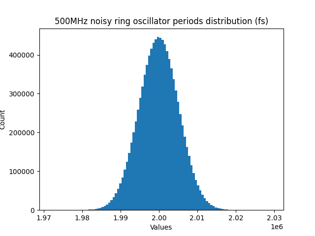
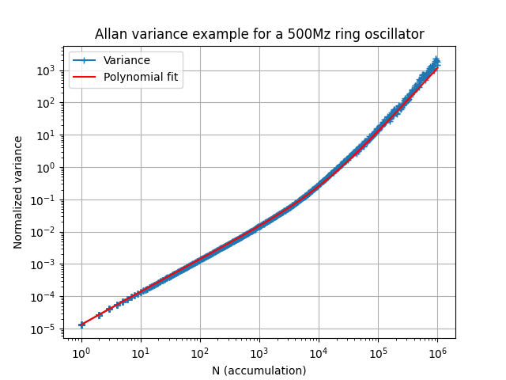
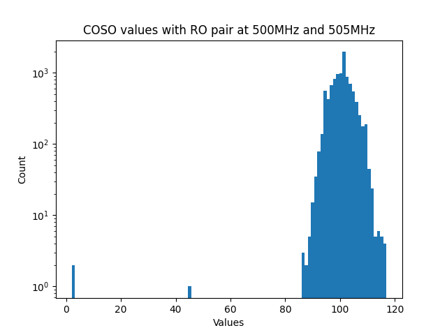

# Introduction

Welcome to **OpenTRNG/entropy**! This project is dedicated to delivering the community open-source implementations of reference entropy sources based on ring oscillators for a Physical True Random Number Generator (TRNG or PTRNG). Through **OpenTRNG/entropy**, you have the capability to:

1. [Emulate noisy ring oscillators](#emulate-noisy-ring-oscillators)
2. [Emulate entropy sources](#emulate-entropy-source)
3. [Simulate entropy source HDL](#simulate-entropy-source-hdl)
4. [Run entropy sources on FPGA](#run-entropy-sources-on-fpga)
5. [Analyze and evaluate their outcomes](#analyze-and-evaluate-outputs)

**OpenTRNG/entropy** is fully compatible with [OpenTitan](https://opentitan.org), our entropy source implementations can be used as PTRNG or CSRNG input for OpenTitan's hardware IP blocks.

> [!WARNING]
> The **OpenTRNG** project implements reference implementations for entropy sources and TRNG as found in the scientific litterature, the source code is made available for accademic purposes only. As compliance with verification and certification standards cannot be guarantee, it shall not be deployed "as is" in a product. Please be aware that any misuse or unintended application of this project is beyond the responsibility of CEA. If you plan to integrate a Random Number Generator (RNG) into a product, feel free to contact us.

## License and contributions

The **OpenTRNG** project is distributed under the GNU GPLv3 license.

Pull requests are welcome and will be reviewed before being merged. No integration timelines are promised. The code is maintained by [CEA](https://www.cea.fr/english)-[Leti](https://www.leti-cea.com/cea-tech/leti/english/Pages/Applied-Research/Facilities/cyber-security-platform.aspx).

# Why OpenTRNG?

## Available entropy sources

As of now, **OpenTRNG/entropy** includes the following reference architectures:

* Elementary based Ring Oscilator (ERO),
* Multi Ring Oscilator (MURO),
* Coherent Sampling Ring Oscilator (COSO).

# Quick-start

## Repository organization

The repository structure contains:

* the `emulator` directory, including the ring oscillator time series emulator,
* the `hardware` directory, containing VHDL for simulation and FPGA implementation,
* the `software` directory, emcompassing all scripts designed for remote control of the **OpenTRNG** plateform on FPGA and for the analysis of the resulting random binary sequences.

## Prerequisites

### Python

Create a virtual environment `$ python3 -m venv .venv` activate the venv `$ .ven/bin/activate` and install required packages with `$ pip install -r requirements.txt`. For other Python environment or package managers (like `conda`), all required modules are listed in `requirements.txt`.

### HDL simulator

You can perform VHDL simulation for **OpenTRNG** blocks using [GHDL](https://github.com/ghdl/ghdl) or other various simulators such as QuestaSim. Ensure that the `ghdl` command (or other simulator command) is accessible in your path. Testbenches for simulation and verification are written in python with [cocotb](https://www.cocotb.org). The generated waves (`vcd` files) can be displayed with [GTKWave](https://sourceforge.net/projects/gtkwave).

If you are not using `ghdl`, please refer to the `hardware/sim/config.mk` file to configure your own simulator for all the testbenches.

# Emulate noisy ring oscillators

The emulator has the capability to produce time series data for ring oscillators (RO), incorporating phase noise. Each consecutive value represents the absolute timing of the rising edge of the RO signal. The phase noise encompasses both thermal (white) and flicker noise (colored).

As instance, to produce 10,000,000 cycles of a ring oscillator operating at a frequency of 500MHz, execute the following command:

```
$ python emulator/ro.py 10e6 500e6 data/ro.txt
```

Here is an example of the generated file, each line represents a RO period in femtosecond (fs):

```
1999658
1998880
1983733
2001320
1995537
2002511
2003033
2012407
2012336
...
2002883
1999630
```



By default thermal and flicker noise amplitude coefficients respectively `a1` and `a2` were measured for 500MHz ringos fabricated on an industrial 28nm FD-SOI (Fully Depleted Silicon on Insulator) technology. Optionnaly, noise amplitudes `a1` and `a2` can be specified for custom thermal and flicker noise model. As instance, with measured coefficients for a ringo at 100MHz in a Xilinx Artix7 FPGA:

```
$ python emulator/ro.py -a1 1.42e-13 -a2 1.15e-25 10e6 100e6 data/ro.txt
```

To obtain additional information about all script parameters, execute `python emulator/ro.y -h`.

# Emulate entropy source

Emulation of the ERO, MURO, and COSO entropy sources is achievable through Python scripts utilizing [noisy ring-oscillator emulation](#emulate-noisy-ring-oscillators). Select an entropy source, specify the frequencies of the desired ring oscillators, and the script will generate a file containing the raw random output.

For example, to produce a stream of 10,000 bits using the ERO entropy source, with the first ring oscillator set at 120MHz and the second one at 122MHz, along with a divisor of 500, run the following command:

```
$ python emulator/ero.py 10000 120e6 122e6 500 data/ero.txt
```

The MURO entropy source employs more than two ring oscillators. For instance, to generate a stream of 10,000 bits using a tuple of ring oscillators at frequencies of 98, 109, and 120MHz, sampled by a ring oscillator at 111MHz with a frequency divisor of 200, utilize the following command:

```
$ python emulator/muro.py 10000 98e6 109e6 120e6 111e6 200 data/muro.txt
```

In a simpler configuration, the COSO requires only two ring-oscillator frequencies as input. To generate a stream of 10,000 bits with a COSO operating at 121MHz and 122MHz, use the following command:

```
$ python emulator/coso.py 10000 121e6 122e6 data/coso.txt
```

Optionnaly, as explained in the previous section, noise amplitudes `a1` and `a2` can be specified for custom thermal and flicker noise model.

For more details on script parameters, execute `python emulator/<*.py> -h`.

The entropy source emulators are used as golden model for HDL simulation (see next section).

# Simulate entropy source HDL

Testbenches for simulating entropy sources are scripted using [cocotb](https://www.cocotb.org) in Python, and they are located in the `hardware/sim` directory. Each testbench comprises multiple test cases. The ring-oscillator emulator is used in the testcases to generate noisy clock signals.

For example, to execute the simulation of the COSO testbench, use the following commands:

```
cd hardware/sim/test_coso
make
```

The summary of the testbench execution is displayed in the terminal:

```
********************************************************************************************
** TEST                                STATUS  SIM TIME (ns)  REAL TIME (s)  RATIO (ns/s) **
********************************************************************************************
** test_coso.test_total_failure_alarm   PASS       10010.00           0.09     113097.26  **
** test_coso.test_gen_random_100        PASS       63706.73           3.67      17337.83  **
********************************************************************************************
** TESTS=2 PASS=2 FAIL=0 SKIP=0                    73716.73           4.04      18252.38  **
********************************************************************************************
```

Thanks to `ghdl` simulator, all testbenches record their waveform data in the `waves.vcd` file. These files can be visualized using tools like [GTKWave](https://sourceforge.net/projects/gtkwave), for example.

# Run entropy sources on FPGA

## Global FPGA architecture

# Analyze and evaluate outputs

All analyze and evaluation tools are available in the `analyze` directory.

## Allan variance

You can compute the Allan Variance using data for a ring oscillator time serie, whether it's obtained from measurements or emulation. The Python script `allanvariance.py` can plot the normalized Allan Variance versus samples accumulation. For instance, you can use the following command to plot the Allan Variance of an emulated ring oscillator:

```
$ python analysis/allan_variance.py -t "Plot title" data/ro1.txt data/allanvar.png
```



Please note that the Allan variance can also be plotted for the COSO counter values to estimate thermal and flicker noise contributions.

## COSO counter distribution

You can visualize the counter values generated by the Coherent Sampling Ring Oscillator (COSO), whether simulated or obtained from the FPGA board, by creating a histogram using the Python script `distribution.py`.

```
$ python analysis/distribution.py -t "Plot title" data/coso_tb.txt data/distribution.png --log
```



The provided example illustrates the generation of a COSO log-distribution plot using data from `coso_tb.txt`, which is produced through simulation.

## Entropy estimation

Entropy estimators take binary files as input. The script `tobinary.py` can be used to convert ERO, MURO and COSO text output files to binary. This script takes one integer value (0, 1, or n) per line, extracts the less significant bit (LSB) and pack successive bits to bytes.

You can estimate entropy of the generated binary streams with the script `entropy.py` and different estimators:
* Shannon entropy ([Wikipedia](https://en.wikipedia.org/wiki/Entropy_(information_theory)))
* Most Common Value (from [NIST SP800-90B](https://csrc.nist.gov/pubs/sp/800/90/b/final))
* Markov (from [NIST SP800-90B](https://csrc.nist.gov/pubs/sp/800/90/b/final))
* T8 from [BSI AIS 20/31](https://www.bsi.bund.de/dok/randomnumbergenerators) test procedure B

Estimators can be computed for different samples size from 1 to 32 bits.

```
$ python analysis/entropy.py data/ero_tb.bin mcv -b 8
```

The provided example computes the MCV estimator on 8 bits samples read from the `ero_tb.bin` binary file.

## Auto-correlation

The Python script `autocorrelation.py` plots the autocorrelation for a random binary file, read by words of `b` bits. The `d` parameter limits the maximum lag (depth) of the signal correlation with itself.

```
$ python analysis/autocorrelation.py -t "Plot title" data/coso_tb.bin autocorr.png -b 8 -d 100
```

This example plots the correlation of the signal with itself in a maximum lag of 100 samples of 8 bits each.

# Appendix: Howtos and receipes

## How to generate 10M bits with ERO

Assume we want to generate 1e7 raw random bits with an ERO running at 500MHz and a division factor of 1000. Output rate will be at 500kbit/s, we need 1e7 x 1000 = 1e10 periods of rings (80GB for each RO file, ouch!).


```
python emulator/generate_ro.py 1e10 500e6 > data/ro1.txt
python emulator/generate_ro.py 1e10 500e6 > data/ro2.txt
```

Lets start for 20s of simulated time (takes several CPU hours depending its performance)!

```
cd hardware/sim
make compile
make run TESTBENCH=ero_tb DURATION=20s
```

Please note that for long time series, the emulator requires a significant amount of RAM. In such cases, it is advisable to split the generation process into smaller segments and concatenate them.

## How to estimate thermal and flicker noise amplitude factors

## How to run standardized test
