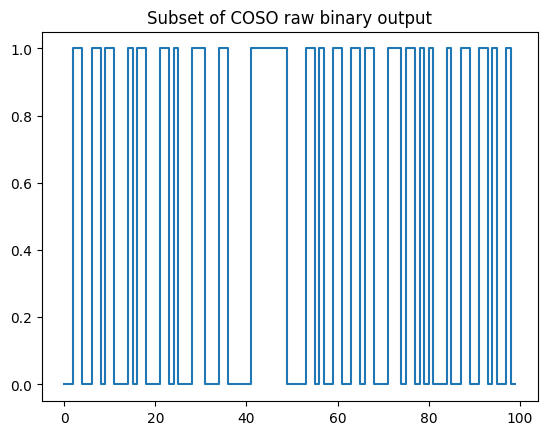

# Introduction

This directory contain all python files related to [ring-oscillator](#emulate-noisy-ring-oscillators) and [raw random number](#emulate-raw-random-numbers) emulation. Emulators can be called directly with proposed scripts (see sections below).

> [!TIP]
> To obtain additional information about all script parameters, use the `-h` option.

The emulator directory also contains a jupyter notebook `playground.ipynb` if you need to understand and use the emulator internal routines.

# Emulate noisy ring oscillators

The emulator has the capability to produce time series data for ring oscillators (RO), incorporating phase noise. Each consecutive value represents the absolute timing of the rising edge of the RO signal. The phase noise encompasses both thermal (white) and flicker noise (colored).

As instance, to produce 10,000,000 cycles of a ring oscillator operating at a frequency of 500MHz, execute the following command:

```
$ python ro.py -size 10e6 -freq 500e6 ro.txt
```

Here is an example of the generated file, each line represents a RO period in femtosecond (fs):

```
1999658
1998880
1983733
2001320
1995537
2002511
...
2002883
1999630
```


By default thermal and flicker noise amplitude coefficients respectively `a1` and `a2` were measured for 500MHz ringos fabricated on an industrial 28nm FD-SOI (Fully Depleted Silicon on Insulator) technology. Optionnaly, noise amplitudes `a1` and `a2` can be specified for custom thermal and flicker noise model. As instance, with measured coefficients for a ringo at 100MHz in a Xilinx Artix7 FPGA:

```
$ python ro.py -size 10e6 -freq 100e6 -a1 1.42e-13 -a2 1.15e-25 ro.txt
```

# Emulate raw random numbers

Emulation of raw random number (RRN) is achievable through Python scripts utilizing [noisy ring-oscillator emulation](#emulate-noisy-ring-oscillators). Specify the frequencies of the desired ring oscillators, select a sampling architecture in ERO, MURO or COSO, and the script will generate a file containing the raw random output.

For example, to produce a stream of 10,000 bits using the ERO, with a first ring-oscillator set at 120MHz along with a divisor of 500 that samples the second ring-oscillator at 122MHz, run the following command:

```
$ python ero.py -size 10000 -freq0 120e6 -freq1 122e6 -div 500 ero.txt
```

The MURO employs more than two ring oscillators. For instance, to generate a stream of 10,000 bits with a sampling frequency at 111MHz divided by 200 that samples a tuple of ring oscillators at frequencies of 98, 109, and 120MHz, utilize the following command:

```
$ python muro.py -size 10000 -freq 111e6 98e6 109e6 120e6 -div 200 muro.txt
```

In a simpler configuration, the COSO requires only two ring-oscillator frequencies as input. To generate a stream of 10,000 bits with a COSO operating at 121MHz and 122MHz, use the following command:

```
$ python coso.py -size 10000 -freq0 121e6 -freq1 122e6 coso.txt
```

Below is an illustration of the raw random output for the COSO.



Optionnaly, as explained in the previous section, noise amplitudes `a1` and `a2` can be specified for custom thermal and flicker noise model.

The RRN emulators are used as golden model for HDL simulation.
