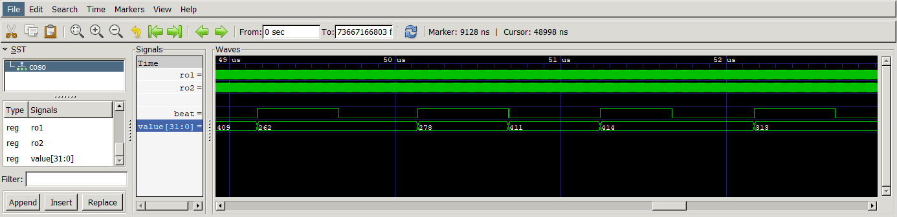

# Hardware architecture

## Dependencies

# Simulate HDL sources

Testbenches for simulating HDL sources are scripted using [cocotb](https://www.cocotb.org) in Python, and they are located in the `hardware/sim` directory. Each testbench comprises multiple test cases. The ring-oscillator emulator is used to generate noisy clock signals in the testcases.

For example, to run the simulation of the COSO testbench, use the following commands:

```
cd hardware/sim/test_coso
make
```

The summary of the testbench simulation is displayed in the terminal:

```
********************************************************************************************
** TEST                                STATUS  SIM TIME (ns)  REAL TIME (s)  RATIO (ns/s) **
********************************************************************************************
** test_coso.test_total_failure_alarm   PASS       10010.00           0.09     113097.26  **
** test_coso.test_gen_random_100        PASS       63706.73           3.67      17337.83  **
********************************************************************************************
** TESTS=2 PASS=2 FAIL=0 SKIP=0                    73716.73           4.04      18252.38  **
********************************************************************************************
```

Thanks to `ghdl` simulator, all testbenches record their waveform data in the `waves.vcd` file. These files can be visualized using tools like [GTKWave](https://sourceforge.net/projects/gtkwave), for example.



# Compile for FPGA

The provided VHDL is target agnostic (it can also be synthetized for ASIC) at the exception of the ring.vhd that describes a configuatble ring-oscillator. For ASIC

## FPGA targets

## Synthetize, place route and program device

# OpenTitan compatibility
